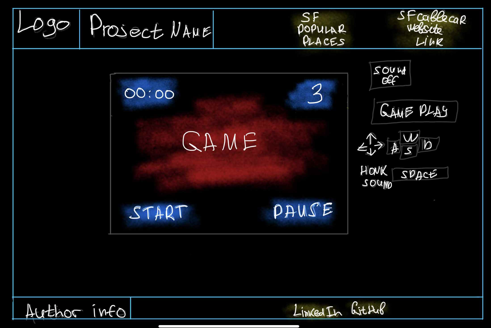

### Tram on rails game

# Background

**Tram on rails** is a 2D game with a top-down view. A tram/cable car will ride on San Francisco Street, trying to avoid collisions with randomly appearing taxi cabs. A tram could go straight/left/right and back. When it honks, taxi cabs will disappear from the screen. There will be an “n” number of honks and an “n” number of possible collisions. A stopwatch starts at the same time a user starts the game. A goal is to avoid obstacles as long as you can. 

### Functionality & MVPs

In the “Tram on rails” game, users will be able to:

- Interact with the website page, click links, mute sound, start and pause the game
- Move a tram/ cable car in all directions on the road in Canvas
- Honk cars to avoid collision and remove objects
- Keep track of the stopwatch and the number of collisions left

In Addition, this project will include:
- Game instruction
- A production README

### Wireframes

### Technologies, Libraries, APIs

This project will be implemented with the following technologies:
- HTML5
- CSS3 
- The Canvas API to render the game board
- Webpack and Babel to bundle and transpile the source JavaScript code
- npm to manage project dependencies

### Implementation Timeline

Friday Afternoon & Weekend
- The HTML structure for the project.
- Canvas layout.
- The basic functionality of the game. Moving objects, obstacles, physics.
- Testing/debugging.

**Monday**
- Collision detection.
- Objects removing functionality.
- Stopwatch.
- Speed increase, “level” behavior.
- Testing/debugging.

**Tuesday**
- Styles for the game.
- Adding “actual” road “moving objects.”
- Collision animation.
- Honking animation.
- Browser page styles (out of the canvas).
- Testing/debugging.

**Wednesday**
- Testing functionality.
- Polishing styles on the page and inside the canvas.
- Add links.
- Add instructions.

**Thursday**
- Finalize the project. 
- Post on the server.
- Prepare for the presentation.
